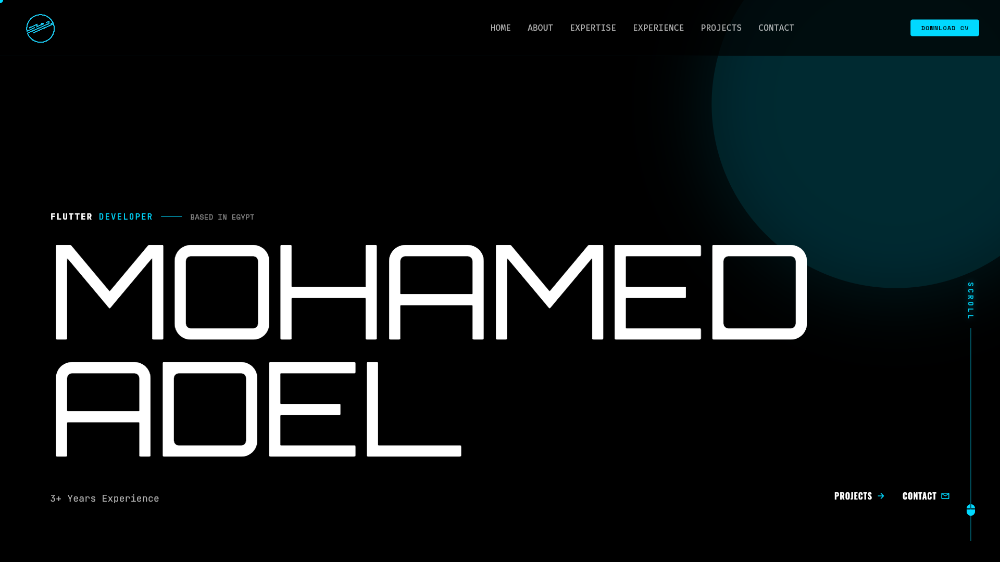

# Mohamed Adel — Flutter Developer Portfolio

**Live site: [muhammed-adel.web.app](https://muhammed-adel.web.app/)**

A fully custom, animated portfolio built with Flutter Web, compiled to
WebAssembly and served from Firebase Hosting.



## Highlights

- **Flutter Web + WASM** — compiled with `--wasm` (Skwasm renderer with
  multi-threading enabled via `Cross-Origin-Opener-Policy` /
  `Cross-Origin-Embedder-Policy` headers on Firebase Hosting).
- **Clean architecture** — feature modules (`hero`, `about`, `expertise`,
  `experience`, `projects`, `contact`) with data / domain / presentation
  layers, Cubit state management, and `get_it` dependency injection.
- **Firestore-driven content** — projects, experience, expertise, and hero
  copy are editable in Firestore without shipping a new build.
- **Performance-focused** — WebP assets, tree-shaken icon fonts, preloaded
  WASM, non-blocking startup data fetches, and long-lived caching for
  static assets.

## Tech stack

Flutter · Dart · Firebase (Firestore, Hosting) · flutter_bloc · get_it ·
flutter_animate · GitHub Actions (CI/CD)

## Development

```bash
flutter pub get
flutter run -d chrome
```

## Deployment

Pushes to `main` build the site (`flutter build web --release --wasm`) and
deploy to Firebase Hosting automatically via GitHub Actions
(`.github/workflows/deploy-firebase.yml`). Manual deploy:

```bash
flutter build web --release --wasm --base-href="/"
firebase deploy --only hosting:muhammed-adel
```
