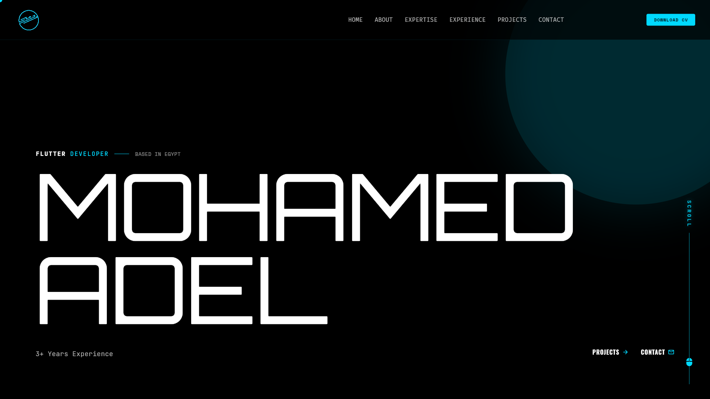

# Mohamed Adel — Flutter Developer Portfolio

**Live site: [muhammed-adel.web.app](https://muhammed-adel.web.app/)**

A custom, animated portfolio written in Dart with [Jaspr](https://jaspr.site),
pre-rendered to static HTML and served from Firebase Hosting.



## Highlights

- **Static pre-rendering** — Jaspr runs in `static` mode, so every route
  (`/`, `/about`, `/projects`, `/contact`) ships as its own plain HTML file.
  Crawlers and `llms.txt` readers get the real content without running
  JavaScript.
- **Firestore-driven content** — hero copy, about, expertise, experience and
  projects are read from Firestore over its public REST API at build time
  (`jaspr_site/lib/data/firestore_rest.dart`) and baked into the HTML. Edit
  content in Firestore, then rebuild to publish it.
- **Small client islands** — only the interactive parts (header scroll state,
  custom cursor, scroll reveal, project showcase, contact form) hydrate in the
  browser; everything else is static markup.
- **Contact form** — posts straight to Web3Forms from the browser.

## Tech stack

Dart · Jaspr · jaspr_router · Firebase (Firestore, Hosting) · Web3Forms ·
GitHub Actions (CI/CD)

## Project layout

```
jaspr_site/          The live site
  lib/app.dart       Root component and routes
  lib/pages/         One file per route
  lib/sections/      Home-page sections (hero, about, expertise, ...)
  lib/components/    Shared and client-side components
  lib/data/          Firestore repositories (build-time fetches)
  lib/constants/     Theme tokens
  web/               Static files copied as-is (images, llms.txt, robots.txt)
firebase.json        Hosting config used by CI (serves jaspr_site/build/jaspr)
firestore.rules      Firestore security rules
```

The Flutter Web app at the repo root (`lib/`, `android/`, `ios/`, ...) is the
previous version of the site. It is no longer built or deployed and is kept
only as reference.

## Development

Requires the Dart SDK (3.10+) and the Jaspr CLI. CI pins `jaspr_cli` to
0.23.2, which is the version known to build cleanly.

```bash
dart pub global activate jaspr_cli 0.23.2
cd jaspr_site
dart pub get
jaspr serve        # http://localhost:8080
```

## Deployment

Every push to `main` runs `.github/workflows/deploy-firebase.yml`, which builds
the site with `jaspr build --sitemap-domain=https://muhammed-adel.web.app` and
deploys `jaspr_site/build/jaspr` to Firebase Hosting (site `muhammed-adel`).
Because content is fetched at build time, Firestore edits go live on the next
deploy.

Manual deploy, from the repo root:

```bash
(cd jaspr_site && jaspr build --sitemap-domain=https://muhammed-adel.web.app)
firebase deploy --only hosting:muhammed-adel --project my-website-bf9e6
```

`.github/workflows/deploy.yml` publishes a redirect page to GitHub Pages so the
old `github.io` URL forwards to the Firebase site.
